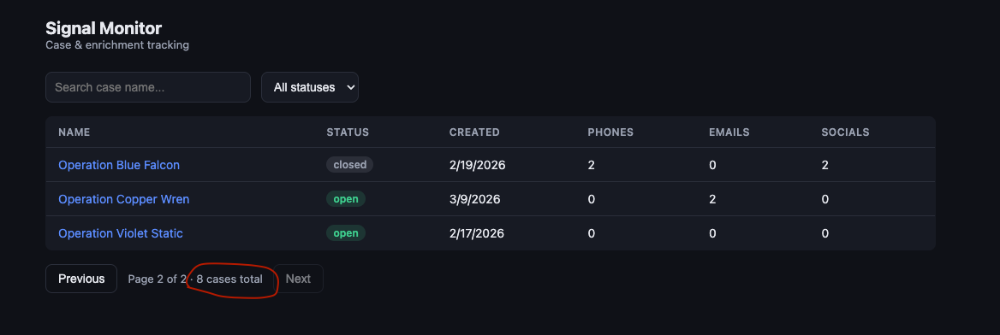
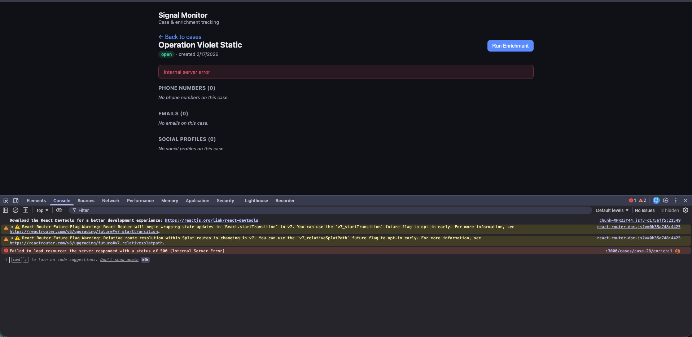
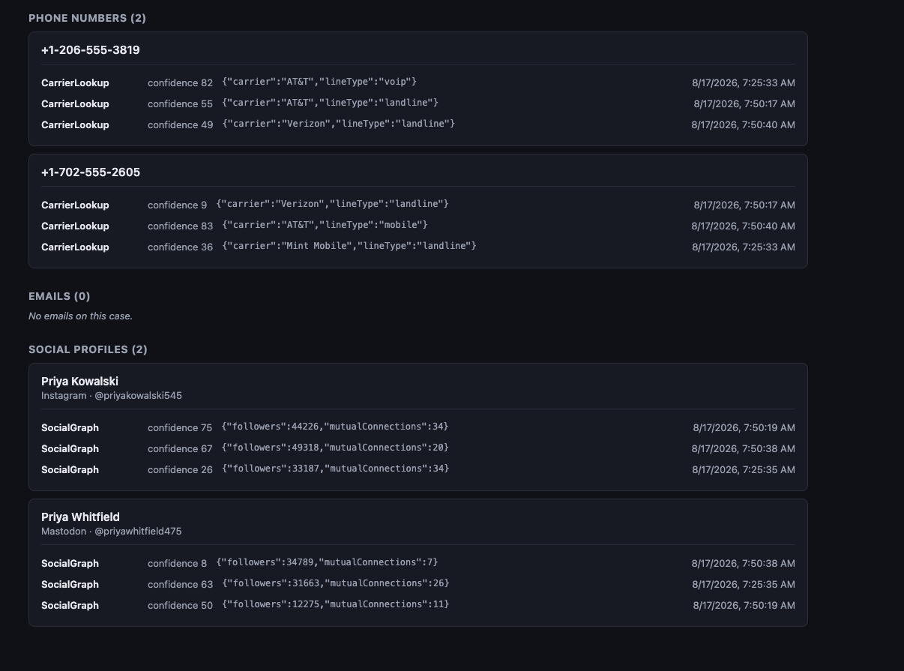
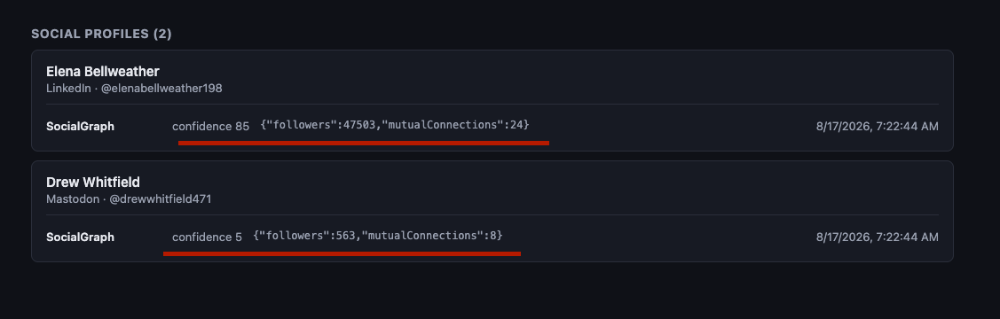
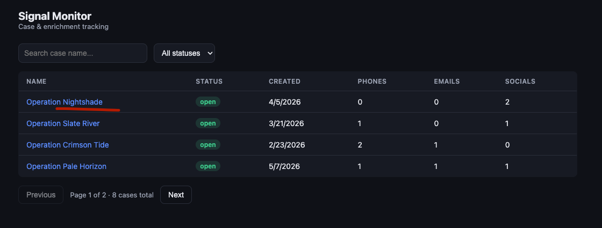

# Signal Monitor: Bug Report

Target: Signal Monitor (backend `localhost:3000`, frontend `localhost:5173`), seeded data (SEED=42, deterministic across restarts).

*Optional: a styled, severity-grouped version of this same report is viewable live at [reutweibel.github.io/signal-monitor-qa/extras/bug-report.html](https://reutweibel.github.io/signal-monitor-qa/extras/bug-report.html).*

---

# High Severity

*core flows broken or corrupted, no workaround*

---

## 1. Paginated case list silently drops one case per page boundary, wrong case counter

**Title:** Case list pagination drops one case at every page boundary and shows a wrong case counter: a case can become permanently unreachable via the UI

**Steps to reproduce:**
1. Open `http://localhost:5173` (case list, default page size).
2. Note the "N cases total" count at the bottom.
3. Page through all pages and count the distinct cases actually rendered.
4. Compare against `GET /cases/:id` for a case not shown in any page (e.g. `case-19`).

**Expected result:** The number of cases actually visible across all pages equals the reported total, and every case is reachable from the list.

**Actual result:** With `limit=5`, page 1 shows 4 cases and page 2 shows 3 (7 total), while the API reports `total: 8`. The missing case, `case-19` ("Operation Quiet Harbor"), is never shown on any page. Confirmed it exists and is fetchable directly via `GET /cases/case-19`. Root cause identified in `backend/src/cases/cases.service.ts:36`:
```ts
const data = filtered.slice((page - 1) * limit, page * limit - 1);
```
The slice end index is off by one (`page * limit - 1` instead of `page * limit`), so every page returns only `limit - 1` items, permanently dropping one record per page boundary, not just for this dataset/limit, but for any dataset spanning multiple pages at any limit.



**Environment/conditions:** Frontend `localhost:5173`, backend `localhost:3000`, default seed. Reproducible every time (deterministic seed, in-memory data computed once at backend startup), not intermittent.

**Severity:** High. This is a data-completeness/discoverability defect, not cosmetic: a real case can become effectively invisible through the list, search, and filter UI (only reachable if the user already has its direct URL/ID). For a case-management tool, an undiscoverable case is a meaningful risk to whoever relies on the list as their source of truth.

---

## 2. Running enrichment on a case with no data items crashes the backend (500)

**Title:** `POST /cases/:id/enrich` throws an unhandled 500 error for any case with zero phone numbers, zero emails, and zero social profiles

**Steps to reproduce:**
1. Navigate to a case with no items at all, e.g. `case-28` ("Operation Violet Static"), which has 0 phone numbers / 0 emails / 0 social profiles.
2. Click "Run Enrichment".

**Expected result:** Either the enrichment job starts and completes trivially (no sources have anything to process), or the button is disabled with a clear message like "No data items to enrich," or the API returns a clean 4xx with a meaningful error.

**Actual result:** The request fails with `500 Internal Server Error`. The frontend surfaces the raw string "Internal server error" inline on the case page, with no retry option and no indication of what went wrong. Confirmed via direct API call: `curl -X POST http://localhost:3000/cases/case-28/enrich` → `{"statusCode":500,"message":"Internal server error"}`.



Root cause confirmed from backend logs, `backend/src/enrichment/enrichment.service.ts:82`:
```ts
const totalExpectedEnrichments = itemCountsByType.filter((n) => n > 0).reduce((a, b) => a + b);
```
When all three item counts are 0, `.filter((n) => n > 0)` returns `[]`, and calling `.reduce()` on an empty array with no initial value throws `TypeError: Reduce of empty array with no initial value`, an unhandled exception that bubbles all the way up to a generic 500 response.

**Environment/conditions:** Frontend `localhost:5173`, backend `localhost:3000`. Reproducible 100% of the time for any case with 0 items across all three categories (at minimum `case-28` in the default seed).

**Severity:** High. This is a core user action (the entire enrichment feature) crashing outright for a case that exists by design in the seeded data, not an obscure edge case, but one the app ships with out of the box. No graceful degradation, no user-facing explanation, and the backend logs an unhandled exception on every occurrence.

---

## 3. No double-submit guard on "Run Enrichment"

**Title:** No double-submit guard on "Run Enrichment": repeated clicks spawn concurrent jobs that duplicate enrichment data

**Steps to reproduce:**
1. Open a case with at least one phone/email/social item and no existing enrichments (e.g. `case-6`, "Operation Slate River").
2. Click "Run Enrichment" twice in quick succession (or simulate via two rapid `POST /cases/case-6/enrich` calls).
3. Wait for both jobs to finish, then reload the case.

**Expected result:** Either the button is disabled while a job is in progress (preventing a second submission), or re-triggering enrichment is a supported action that clearly replaces/supersedes the prior run rather than running invisibly alongside it.

**Actual result:** Both requests succeed with **different `jobId`s**, running independently. `GET /cases/case-6/enrichment-status` only ever exposes the *latest* job: the first job's progress is never shown. Both still completed and wrote results: `phone-4` and `social-5` each ended up with **two entries** from a single user action.

Root cause: `frontend/src/pages/CaseDetailPage.tsx:90`, the "Run Enrichment" `<button>` has no `disabled` state tied to whether a job is in flight, so nothing prevents re-clicking. On the backend, `enrichment.service.ts`'s `startJob()` has no check for an already-running job on the same case either; `latestJobIdByCase` is simply overwritten (`enrichment.service.ts` `startJob`), orphaning the previous job from the case's perspective while its timers keep running and mutating shared case data.

**Environment/conditions:** Frontend `localhost:5173`, backend `localhost:3000`. Reproducible on any case with at least one item; more strikingly visible if the user clicks more than twice (N clicks → N concurrent jobs, N-fold duplicate results, only the last one ever shown running/completing).

**Additional evidence (manually reproduced on `case-14`, "Operation Pale Horizon"):** clicking "Run Enrichment" 3 times in quick succession from a clean case produced **3 separate jobs** and **3 enrichment entries per item**, not identical copies but independently-simulated results that can directly contradict each other:

| Entry | Confidence | Carrier | Line type |
|---|---|---|---|
| 1 | 78 | AT&T | landline |
| 2 | 95 | AT&T | mobile |
| 3 | 99 | Verizon | mobile |

All three are for the *same phone number*, giving an analyst three contradictory "facts" with no indication any came from a redundant run rather than genuinely different sources.

**Severity:** High. This is trivially reachable through normal, plausible user behavior (a double-click, or repeated re-clicks because the button gives no immediate feedback), no special conditions needed. It silently pollutes case data with duplicate, sometimes contradictory enrichment entries and gives the user zero indication that redundant runs happened or that some results on screen came from a run they never saw progress for. For a tool whose value proposition is trustworthy, explainable signal data, silent duplication with no audit trail is a meaningful data-integrity concern.

**Notes:** Manually verified up to 3 concurrent clicks; did not test higher click counts or whether duplicate entries compound further on subsequent "normal" (non-overlapping) re-runs of the same case, flagging as unverified but likely to follow the same pattern.

---

# Medium Severity

*misleads the user, no crash or data loss*

---

## 4. Enrichment results sorted by confidence score using string comparison instead of numeric, sorting bug

**Title:** Enrichment results sorted by confidence score using string comparison instead of numeric, a sorting bug: highest-confidence result can end up at the bottom of the list

**Steps to reproduce:**
1. Open a case with multiple enrichments on the same item, where confidence scores span different digit-lengths (single-digit, double-digit, and/or 100).
2. Observe the display order of enrichment rows.

**Expected result:** Enrichments sorted numerically descending by `confidenceScore`: highest actual confidence value first.

**Actual result:** Sorting uses `String(confidenceScore).localeCompare(...)` (`frontend/src/components/EnrichmentList.tsx:8-9`), comparing scores as text rather than numbers. Verified with scores [100, 80, 55, 9, 5]: actual displayed order is **[9, 80, 55, 5, 100]**: confidence 9 appears first (top), while the maximum possible score of 100 appears last (bottom). The ordering is effectively inverted for the highest-confidence result, not just imprecise.

**Additional evidence (from live app, case-24 "Operation Blue Falcon"):** the bug is independently confirmed by real enrichment data, and rules out an alternative "sorted by run timestamp" explanation:

| Item | Displayed order (confidence) | Actual timestamps in that order |
|---|---|---|
| Phone `+1-702-555-2605` | 9, 83, 36 | 7:50:17, 7:50:40, 7:25:33 |
| Social `Priya Kowalski` | 75, 67, 26 | 7:50:19, 7:50:38, 7:25:35 |
| Social `Priya Whitfield` | 8, 63, 50 | 7:50:38, 7:25:35, 7:50:19 |

None of these are chronologically ordered (the 7:25 timestamp lands in the middle in every case), ruling out timestamp-based sorting. All three match the string-comparison pattern exactly (e.g. `"9" > "83" > "36"` as text, since `'9' > '8' > '3'` by character).



**Environment/conditions:** Frontend `localhost:5173`, any case with enrichment results whose confidence scores cross digit-length boundaries (1-digit vs. 2-digit vs. 100).

**Severity:** Medium. This misrepresents result reliability to the user rather than just looking wrong: an analyst trusting "top of list = most confident" is actively misled, which cuts against the product's core "explainable/traceable" value proposition.

**Notes:** Did not exhaustively check whether this same string-sort pattern appears elsewhere in the codebase, worth a quick grep, flagging as unverified.

---

# Low Severity

*real gaps, limited or no user-facing impact today*

---

## 5. Enrichment result payloads rendered as raw unformatted JSON

**Title:** Enrichment `result` field rendered as raw `JSON.stringify()` output instead of formatted/labeled fields

**Steps to reproduce:**
1. Open any case with at least one completed enrichment.
2. Look at the enrichment row for any phone/email/social item.

**Expected result:** Enrichment results presented in a readable, labeled format appropriate for an analyst-facing tool (e.g. "Carrier: AT&T · Line type: voip" rather than raw JSON syntax).

**Actual result:** The result is rendered as a raw JSON string, e.g. `{"followers":47503,"mutualConnections":24}` or `{"carrier":"AT&T","lineType":"voip"}`, with no field labels or formatting. Confirmed in `frontend/src/components/EnrichmentList.tsx:18`:
```tsx
<span className="result">{JSON.stringify(e.result)}</span>
```



**Environment/conditions:** Frontend `localhost:5173`, any case with completed enrichments. Affects 100% of enrichment result rows: different sources (`CarrierLookup`, `SocialGraph`, `BreachDatabase`) produce differently-shaped result objects, so the raw JSON also varies in structure/length row to row with no consistent visual structure.

**Severity:** Low. No data is lost or incorrect: this is a readability/presentation gap, not a functional defect. Notable because the product's own value proposition is "explainable," structured identity signals; raw JSON dumps run counter to that for an analyst-facing UI.

---

## 6. `GET /cases` has no input validation on `page`/`status`: malformed requests return silently-wrong data instead of an error

**Title:** `GET /cases` accepts invalid `page` and `status` values without validation, returning misleading data instead of a 400 error

**Steps to reproduce (API-level, not reachable through the current UI, which only ever sends values from its own valid controls):**
1. `GET /cases?page=0&limit=5`
2. `GET /cases?page=-1&limit=5`
3. `GET /cases?page=abc&limit=5`
4. `GET /cases?status=bogus`

**Expected result:** A malformed or out-of-range param returns a clear `400 Bad Request`, or at minimum falls back to a sane default (e.g. page 1); never data that looks legitimate but isn't what was asked for.

**Actual result:** None of these error. Instead each returns a *plausible-looking but wrong* response:

| Input | Response |
|---|---|
| `page=0` | Returns 4 unrelated cases, `"page":0` echoed back as if valid |
| `page=-1` | Returns a *different* 2 cases, still no error |
| `page=abc` | Returns an **empty array** with `total:8` still shown, indistinguishable from a legitimate "no results" |
| `status=bogus` | Silently ignored, returns all statuses unfiltered |

Root cause: `cases.service.ts:36` passes `page`/`limit` straight into `Array.slice()` without checking they're positive numbers first: negative values get reinterpreted by `slice()` as "count from the end," and `NaN` (from `parseInt` on non-numeric input) gets coerced to `0`. Separately, `cases.controller.ts:18-19` only whitelists `'open'`/`'closed'` for `status` and silently drops anything else rather than rejecting it.

**Environment/conditions:** Backend `localhost:3000`, direct API calls only; the shipped frontend never constructs these values itself.

**Severity:** Low. Purely a backend robustness/defensive-coding gap, not a user-facing defect today, flagging because it's the kind of input-validation hole that becomes a real bug the moment any other client (future frontend, integration, or the Part 2 automated tests) talks to this API directly, and because it shares root-cause logic with bug #1.

**Notes:** Did not test `limit=0` or negative/very large `limit`, likely hits similar unvalidated-input behavior, unverified.

---

# Cosmetic

*no functional impact*

---

## 7. Inconsistent codename formatting in mock case data

**Title:** Inconsistent codename formatting in case names: "Operation Nightshade" is single-word while all other seeded cases use two-word codenames

**Steps to reproduce:**
1. Open the case list at `http://localhost:5173`.
2. Compare the `NAME` column across all cases.

**Expected result:** Case codenames follow a consistent naming pattern (all other visible cases, "Slate River", "Crimson Tide", "Pale Horizon", etc., use two-word codenames).

**Actual result:** "Operation Nightshade" uses a single-word codename, breaking the pattern used by every other case. Confirmed at the source: `backend/src/data/seed.ts`, `CODENAMES` array (lines 8-19). "Nightshade" is the only single-word entry among 10 hardcoded codenames.



**Environment/conditions:** Frontend `localhost:5173`, backend `localhost:3000`, default seeded data.

**Severity:** Cosmetic / lowest priority. No functional impact: doesn't affect data integrity, enrichment, filtering, or any user action. Purely a content/copy inconsistency in the static mock word list.

**Notes:** Flagging for completeness/attention-to-detail rather than as a functional defect; not something to prioritize fixing.
